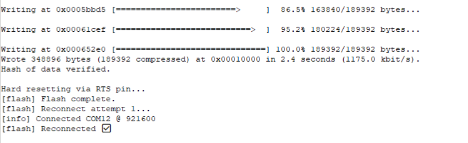
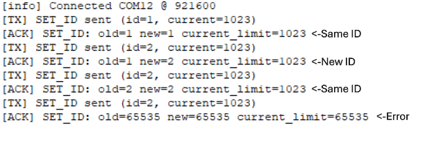
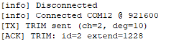

# Firmware

This guide covers architecture, build options, and a detailed communication protocol specification used by the **ESP32‑S3 (Seeed Studio XIAO ESP32S3)** to drive **Feetech HLS3606M servos**.

---

## 🧭 Overview

The firmware exposes a compact **fixed 16‑byte binary serial protocol** for commanding seven actuators (thumb & fingers) and for querying telemetry (position, velocity, current, temperature). It also implements **homing**, **set-id**, **persistent trims**, and safety behaviors on‑board, so a host PC can remain simple.

**Channels (7):**

1. Thumb CMC Abduction Actuator
2. Thumb CMC Flexion Actuator
3. Thumb Tendon Actuator
4. Index Finger Actuator 
5. Middle Finger Actuator
6. Ring Finger Actuator
7. Pinky Finger Actuator

---


### 🧩 First‑Time Setup: Uploading Firmware

To upload firmware to your Aero Hand device:

1. **Refresh all ports** in the GUI to detect connected devices.
2. If multiple ports are listed, identify the port for your ESP device:
  - On **Windows**, it is usually a **COM** port (e.g., COM3, COM12).
  - On **Linux**, look for `/dev/ttyACM0`, `/dev/ttyACM1`, etc.
3. Select the correct port and press the **Upload Firmware** button.
4. A dialog box will open—navigate to and select the appropriate firmware `.bin` file (`firmware_righthand.bin` or `firmware_lefthand.bin`).
5. The tool will upload the `.bin` file to the device at offset address **0x10000**.
6. On successful upload, you will see a confirmation message in the GUI.



#### Notes & Troubleshooting

1. If you encounter errors, first check that you have selected the correct COM port.
2. The tool uses **esptool version 5 or greater**. Older versions may not work, as they use `write_flash` instead of `write-flash`.
3. After flashing, the tool will attempt to reconnect to the ESP automatically (up to 3 attempts). Usually, it connects on the first try. If not, refresh your ports and try again.
4. The firmware is uploaded to offset **0x10000**. Do not use merged or partition `.bin` files, as these may cause errors. Only use the provided bin files from the `aero-open-firmware` repository.

Next step is to set the servo IDs, see the next section below.

#### Setting Servo -IDs

1. **Power** the board with the 6V and connect USB.
2. **Connect exactly one servo** to the bus.
3. In the GUI, choose the correct **COM Port**, press **Connect**.
4. Click **Set ID** and assign the servo for the channel you’re wiring:
  * `0 → thumb_abduction_actuator`
  * `1 → thumb_flex_actuator`
  * `2 → thumb_tendon_actuator`
  * `3 → index_finger_actuator`
  * `4 → middle_finger_actuator`
  * `5 → ring_finger_actuator`
  * `6 → pinky_finger_actuator`
5. If the id is successfully set, You will receive an ACK in the RX bar below.
6. If you receive 65535 in oldid,new id and current as ACK , It indicates that the id is not successfully set.
7. After setting up the ID, you can move the responsible slider to make sure whether the actuator is moving or not.
8. Disconnect that servo, plug the next one, and **repeat** until all seven are assigned.



##### Notes & Troubleshooting

1. Make sure that the board has power and exactly one servo is connected before setting the ID.
2. We recommend setting IDs for all servos in sequence (0–6). Any value apart from 0–6 will not be accepted.
3. For current limit, we recommend keeping it at the maximum (1023) and pressing OK—do not change this value unless necessary.
4. After setting the ID, you will receive the old ID, new ID, and current limit of the servo as confirmation.
5. If you receive 65535 in old ID, new ID, and current limit, this indicates that two or more servos are present and the Set ID mode will not proceed.
6. Once all IDs are Set, We recommend not to use this function once you are playing and training with the hand.

#### Trim Servo

When using Trim Servo:
First, you will be asked to enter the servo channel (0–6), which represents the sequence: thumb abduction, thumb flexion, thumb tendon, and the four fingers. Next, enter the degrees offset. We recommend making adjustments in steps of 10–20 degrees, then observe the effect using the sliders. If something unusual happens, you may need to perform the homing procedure again to reset the extend count to the baseline.

##### Left Hand Actuator Table
| Channel | Actuator Name          | Extend Count | Grasp Count | Motion (°) | Direction | 
|---------|------------------------|--------------|-------------|------------|-----------|
| 0       | Thumb Abduction        | 2048         | 3186        | 100        | +1        | 
| 1       | Thumb Flexion          | 865          | 2048        | 104        | -1        | 
| 2       | Thumb Tendon           | 2980         | 0           | 262        | +1        | 
| 3       | Index Finger           | 817          | 4095        | 288        | -1        | 
| 4       | Middle Finger          | 817          | 4095        | 288        | -1        | 
| 5       | Ring Finger            | 817          | 4095        | 288        | -1        |
| 6       | Pinky Finger           | 817          | 4095        | 288        | -1        |

##### Right Hand Actuator Table

| Channel | Actuator Name          | Extend Count | Grasp Count | Motion (°) | Direction | 
|---------|------------------------|--------------|-------------|------------|-----------|
| 0       | Thumb Abduction        | 2048         | 910         | 100        | -1        |
| 1       | Thumb Flexion          | 3231         | 2048        | 104        | +1        |
| 2       | Thumb Tendon           | 1115         | 4095        | 262        | -1        | 
| 3       | Index Finger           | 3278         | 0           | 288        | +1        | 
| 4       | Middle Finger          | 3278         | 0           | 288        | +1        |
| 5       | Ring Finger            | 3278         | 0           | 288        | +1        |
| 6       | Pinky Finger           | 3278         | 0           | 288        | +1        |

*Motion (°) is calculated as (Grasp Count - Extend Count) / 11.375*

##### Example: Trimming Right Hand Servo Channel 2 by +10 Degrees

Suppose you set +10 degrees trim for the right hand, servo channel 2 (Thumb Tendon Actuator):
- Original Extend Count: 1115
- Grasp Count: 4095
- Each degree corresponds to 11.375 counts.
- So, +10 degrees will update Extend Count to:
  
  1115 + (10 × 11.375) = 1228 (rounded to 1228)

- The new range of motion will be:
  
  4095 - 1228 = 2867 counts

This means the servo will now move through 2867 counts instead of the original 2980 counts which represent 262 degrees of motion and now it will move 252 degrees of total motion only, which will reduce the full range of motion and make it more tight. If you do in the opposite direction , It will increase the motion of servo which will loose the wire and may cause issues. Since , You cannot mofidy the grasp count of the servo, We recommned to go through this table before doing any changes.



##### Notes & Troubleshooting
1. Do not enter values like 360 or -360 degrees, as this may completely change your control direction—please avoid this.
2. If the servo becomes too tight, try loosening it by entering degrees in the opposite direction to your last adjustment.
3. Use this function only when you want fine control over the servo's range of motion.
4. Disconnect power immediately if any actuator moves to an abrupt position and draws stall current (typically 1.3–1.5A).


### 🎛️ Top Bar Controls

* **Port**: Dropdown of available serial ports.
  Use **Refresh** to re‑scan if you plug/unplug devices.
* **Baud**: Serial speed. Default 921600 is typical for fast streaming and our firmware uses the same baudrate as well.
* **Connect / Disconnect**: Open or close the selected serial port.
* **Rate (Hz)**: How often the GUI streams **CTRL_POS** frames while you move sliders.
  **Recommended:** 50 Hz for smooth motion without saturating USB.

### 🧪 Action Buttons (left→right)

* **Homing** 🏠: Sends opcode `0x01` to run the on‑board homing routine.Any Other Input is ignored while homing is active; wait for ACK under a given timeout of 3minutes.
* **Set ID** 🆔: Guided flow to set a servo’s bus ID. Requires a **single** servo connected; the firmware verifies this before writing.
* **Trim Servo** ✂️: Fine‑tune alignment per channel. Enter **channel (0–6)** and **degrees offset** (±). The firmware adjusts/persists the channel’s `extend_count` in NVS so it survives reboots. Use small steps (±5–10°) and test.
* **Upload Firmware** ⬆️: Flash a `.bin` directly from the GUI. After selection, the board is reset into bootloader, the image is written, and the device restarts.
* **Set to Extend** 🔄: Sends a single **CTRL_POS** frame that sets **all channels to 0.000** (fully open / extend posture). Handy as a “panic open”.
* **GET_POS** 📍: Requests positions. Values are shown normalized **0.000 → 1.000**, computed from each channel’s `extend↔grasp` calibration (host 0..65535).
* **GET_VEL** 💨: Requests velocities of the actuator motions.
* **GET_CURR** 🔌: Requests currents in **mA**, **signed** — the **sign reflects motor direction** relative to the channel’s servo direction (use magnitude to gauge load).
* **GET_TEMP** 🌡️: Requests temperatures (°C) from each servo.
* **GET_ALL** 📦: Convenience burst that triggers **POS + VEL + CURR + TEMP** reads in one go and prints results to the log.
* **Set Speed** 🚀: Sets the speed limit for a selected servo ID (opcode `0x31`). This sets the maximum speed for that servo; by default, the speed is max and resets after reboot. The speed set here affects the max speed the motor moves during the position control mode, which is different from the speed control mode.
* **Set Torque** 💪: Sets the maximum torque limit for a selected servo ID (opcode `0x32`). This limits the maximum torque; by default, torque is max and resets after reboot. The torque set here affects the max torque the motor can apply during the position control mode, which is different from the torque control mode.

### 🧷 Sliders Panel (Center)

Each row controls a single actuator channel with a **normalized slider**:

* **0.000 → 1.000** maps linearly to the channel’s calibrated **extend ↔ grasp** range in 2 bytes and sent as 14 bytes payload using CTRL_POS Command.
* While you drag, the GUI streams **CTRL_POS** frames at the selected **Rate (Hz)**.
* Two small numeric readouts show the current command and (when polled) the latest normalized feedback.

**Channel map (top→bottom):** `thumb_abduction_actuator`, `thumb_flex_actuator`, `thumb_tendon_actuator`, `index_finger_actuator`, `middle_finger_actuator`, `ring_finger_actuator`, `pinky_finger_actuator`.

### 📟 Status & Logs (Bottom)

* **Status bar** (left): Connection state (e.g., *Disconnected*, *COM12 @ 921600*), last error, and homing/flash progress messages.
* **RX Log**: Text console of responses/telemetry. Useful for debugging, verifying opcodes, and viewing GET_* results.
* **Clear Log**: Clears the RX Log display (does not affect device state).

### 🧰 Tips & Tricks

* **Port not listed?** Click **Refresh**; check drivers, cables, and that no other app is holding the port.
* **Set‑ID fails?** Ensure only one servo is connected and the servo rail is powered.
* **No motion?** Verify you selected the correct hand build (left/right), try **Set to Extend**, then move sliders slowly.
* **Choppy control?** Lower **Rate (Hz)** or close other serial/USB‑heavy apps.

## 🧰 Hardware & Software Requirements

* **MCU:** Seeed Studio XIAO ESP32‑S3 (8 MB flash recommended)
* **Servos:** Feetech HLS/SC family (e.g., HLS3606M), IDs mapped to 7 actuators
* **Power:** Servo rail 6–9 V with adequate current capacity; USB-C 5 V for MCU. We recommend a stable power supply at 6V for driving the hand capable of delivering upto 10A.
* **Tools:** Arduino IDE **or** PlatformIO

---

## ⚡ Quick Start

1. **Select the hand** (left/right) in `HandConfig.h` or via a build flag (see below).
2. **Build & flash:**
   * **PlatformIO:** choose `seeed_xiao_esp32s3` ➜ **Upload**
   * **Arduino IDE:** open main sketch ➜ set board to **XIAO ESP32S3** ➜ **Upload**
3. **First boot:** open a serial monitor at the configured baud (commonly 921600 or 1 000 000). Verify the board enumerates and servos respond OK if power is connected.

---

## 📁 Repository Layout

```
/firmware
  ├─ firmware_v0.1.0.ino         # Main sketch: init, parser, handlers, tasks
  ├─ HandConfig.h                # LEFT_HAND / RIGHT_HAND selection
  ├─ Homing.h                    # Homing API + ServoData type
  ├─ Homing.cpp                  # Homing implementation + baselines
  └─ libraries/                  # Third‑party libraries as needed
```

---

## 🔁 Build Configuration: Left vs Right Hand

You can switch hands either by editing `HandConfig.h` **or** using build flags.

* **PlatformIO** (`platformio.ini`):

  ```ini
  [env:seeed_xiao_esp32s3]
  platform = espressif32
  board = seeed_xiao_esp32s3
  framework = arduino
  build_flags = -DRIGHT_HAND       ; or -DLEFT_HAND
  ```
* **Arduino IDE:** temporarily uncomment the macro in `HandConfig.h`.

> Tip: Keep a default committed (often `RIGHT_HAND`) and override via CI or local flags when building the opposite hand.
> Note: You can also use the aero-hand-gui to upload a bin file directly onto the ESP32S3 without using any of this software.

---

## 🔌 Communication Protocol

The protocol is **always 16 bytes** per frame, both **to** and **from** the device. Payload words are **little‑endian**.

### Frame Format

| Bytes | Field       | Description                                 |
| ----: | ----------- | ------------------------------------------- |
|     0 | **OPCODE**  | Command / request code                      |
|     1 | **FILLER**  | Always `0x00` (reserved)                    |
| 2..15 | **PAYLOAD** | 14‑byte payload; semantics depend on opcode |

> **ACK/Responses** also use the same 16‑byte frame shape; byte 0 contains the response opcode, byte 1 is `0x00`.

### Opcode Reference

> The table below is the canonical mapping used by this firmware version.

| Opcode | Name         | Direction | Payload (PC→Device unless noted)  | Notes                                                                                                             |
| :----: | ------------ | :-------: | --------------------------------- | ----------------------------------------------------------------------------------------------------------------- |
| `0x01` | **HOMING**   |   PC→Dev  | none (payload = zeros)            | Runs full homing & calibration; blocks other commands until complete; returns an ACK.                             |
| `0x02` | **SET_ID**   |   PC→Dev  | `u16 new_id`, `u16 current_limit` | Scans bus for the single attached servo, sets its ID and current limit; returns an ACK with old/new ID and limit. |
| `0x03` | **TRIM**     |   PC→Dev  | `u16 channel`, `s16 degrees_off`  | Adjusts stored **extend_count** for a channel; persists in NVS; returns an ACK with the resulting extend count.   |
| `0x11` | **CTRL_POS** |   PC→Dev  | 7×`u16` (ch0..ch6)                | Position write for all channels. 0..65535 spans each channel’s **extend ↔ grasp**. No ACK (fire‑and‑go).          |
| `0x12` | **CTRL_TOR** |   PC→Dev  | 7x`u16` (ch0..ch6)                | Torque write for all channels. 0..1000 is the limit for setting torque to each servo in direction **extend ↔ grasp** . No ACK (fire-and-go)                                                                     |
| `0x22` | **GET_POS**  |   PC→Dev  | none                              | Device replies with 7×`u16` raw positions.                                                                        |
| `0x23` | **GET_VEL**  |   PC→Dev  | none                              | Device replies with 7×`u16` velocities.                                                                           |
| `0x24` | **GET_CURR** |   PC→Dev  | none                              | Device replies with 7×`u16` currents.                                                                             |
| `0x25` | **GET_TEMP** |   PC→Dev  | none                              | Device replies with 7×`u16` temperatures.                                                                         |
| `0x31` | **SET_SPE**  |   PC→Dev  | `u16 id`, `u16 speed_limit`        | Sets the speed limit for the specified servo ID.                                                                  |
| `0x32` | **SET_TOR**  |   PC→Dev  | `u16 id`, `u16 torque_limit`       | Sets the maximum torque for the specified servo ID (different from torque control; this is a limit, not a command).|

#### Position Mapping (CTRL_POS)

For each channel *i*, the firmware maps host value `u16[i]∈[0,65535]` linearly to the servo’s raw count using the per‑channel `extend_count` (open) and `grasp_count` (closed), clamped to `[0,4095]`. Direction is handled via `servo_direction`.

#### Torque Control (CTRL_TOR)

For each channel, the firmware maps the incoming torque value in the range 0..1000 linearly to the raw torque sent to the servo, applying it only in the direction from extend to grasp.

#### Example Sequences

* **Homing**
  PC → Dev: `[0x01, 0x00, 14×0x00]`
  Dev homes all servos → Dev → PC: `[0x01, 0x00, 14×0x00]`

* **Trim channel 3 by −100°**
  PC → Dev: `[0x03, 0x00, 0x03,0x00, 0x9C,0xFF, 10×0x00]`
  Dev updates extend count & saves to NVS → Dev → PC: `[0x03, 0x00, 0x03,0x00, ext_lo,ext_hi, rest 0]`

> **Framing robustness:** Unrecognized opcodes are consumed/ignored to maintain alignment; malformed frames are dropped.

---

## 🧱 Firmware Architecture

### Data Structures

```c++
struct ServoData {              // one per channel
  uint16_t grasp_count;         // closed endpoint (0..4095)
  uint16_t extend_count;        // open endpoint  (0..4095)
  int8_t   servo_direction;     // +1 or −1
};
```

* **Baselines:** compile‑time constants for LEFT and RIGHT hands (7 entries each). A runtime working copy `sd[7]` is refreshed from the baseline (e.g., at boot or before homing).

### Homing Module

* `HOMING_start()` — runs the homing routine for all servos.
* `HOMING_isBusy()` — returns `true` while homing is in progress.
* `resetSdToBaseline()` — copies the correct baseline values into `sd[7]`.

### Concurrency & I/O

* **Bus locking:** all sync read/write operations acquire a semaphore (e.g., `gBusMux`) to prevent collisions.
* **Persistence:** trims (extend counts) are stored in **NVS** so they survive reboots; a full **HOMING** reset returns to baseline.
* **Telemetry:** batched `SyncRead` used for GET_*; CSV printing (if enabled) multiplexed through a single serial writer.

---

## 🧰 Homing Behavior

1. Load the appropriate baseline via `resetSdToBaseline()`.
2. For each servo, drive slowly toward a mechanical stop while monitoring current to detect contact.
3. Calibrate the offset at contact, back‑off/settle, then move to a consistent **extend** posture.

**Notes:** Homing may take around a minute or two overall since each servo is given a timeout of 25s to find a hard mechanical stop in a given direction. During homing, other commands are ignored (buffer on the host if needed), So it will wait for an ACK for a given time period.

---

## 🧩 Extending the Firmware (Add a New Command)

Follow this pattern to add features like LED blink, torque enable, or special saves.

**Step 1 — Define a new opcode**

```c++
static const uint8_t OP_BLINK = 0x42;   // choose an unused byte
```

**Step 2 — Implement a small handler**

```c++
static void handleBlink(uint8_t count) {
  for (uint8_t i = 0; i < count; ++i) {
    digitalWrite(LED_BUILTIN, HIGH); delay(80);
    digitalWrite(LED_BUILTIN, LOW);  delay(80);
  }
}
```

**Step 3 — Wire it into the parser**

```c++
case OP_BLINK: {
  uint8_t count = payload[0];   // interpret first payload byte
  handleBlink(count);
  break;
}
```

**Step 4 — (Optional) ACK**
Return a 16‑byte response if the host should be notified of completion or status.

**Step 5 — Update host tools**
Extend your Python SDK/GUI (e.g., `aero_hand.py`) to emit and consume the new opcode.

---

## 🔐 Safety & Best Practices

* Start with conservative speeds/torque when testing.
* Ensure the servo supply can deliver peak current without large drops.
* Avoid high‑rate position writes during homing.
* Use `HOMING` to re‑establish known geometry if trims become inconsistent.
* Always check power if the servos are not moving.

---

## 🧯 Troubleshooting

* **Wrong hand geometry:** Verify build flag (`-DLEFT_HAND` vs `-DRIGHT_HAND`).
* **Servos move opposite:** Check `servo_direction` or swap extend/grasp counts. We recommend not to change the servo_direction , extend_count can be changed by Trim Servo.
* **Homing stalls:** Inspect current limits/timeouts; verify mechanics move freely.
* **No serial activity:** Confirm COM port/baud and that frames are exactly 16 bytes with valid opcodes.

---

## 📄 License

This project is licensed under **Apache License‑2.0** 

---
## 🤝 Contribution

We welcome community contributions!

If you would like to improve the [Firmware](https://github.com/TetherIA/aero-hand-open/tree/main/firmware) or add new features:

1. Fork and create a feature branch.
2. Add or modify opcodes and handlers as described in Section 9.
3. Include brief unit/bench tests where possible.
4. Commit your changes with clear messages.
5. Push your branch to your fork.
6. Open a PR with a summary and scope of changes.

---

## 🤝 Support & Contact

* Open a GitHub Issue on the project repository
* Email: **[contact@tetheria.ai](mailto:contact@tetheria.ai)**

<div align="center">

Made with ❤️ by **TetherIA Robotics**

</div>
