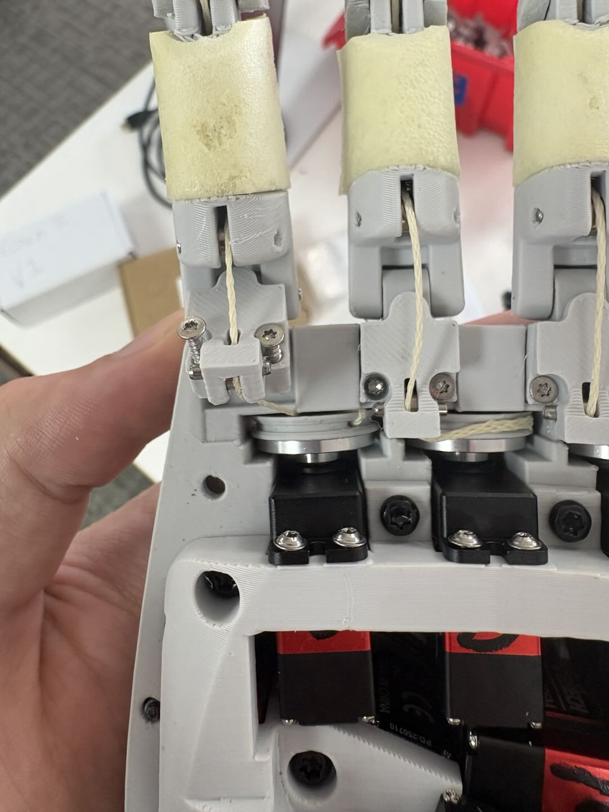
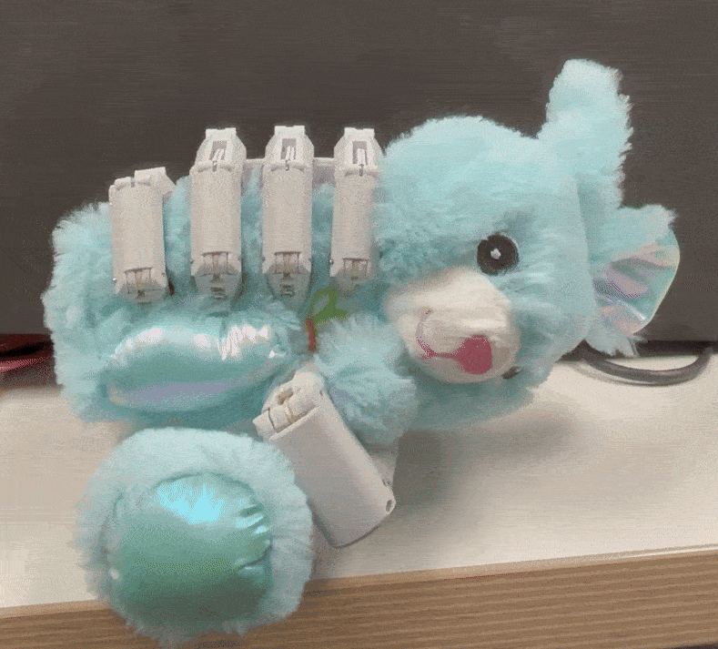

# FAQ

## Cable Derailed from Pulley

As shown in the picture above for the index finger, sometimes the cable (or another) may derail from the pulley. There are a few ways to fix this:
- If the cable is only slightly derailed, you can try gently pulling it back onto the pulley using your hands or a tweezer. Then, perform the homing procedure again, giving the cable a little tension with your hand so it stays on the pulley.
- If you cannot reposition the cable with your hand or a tweezer, do not overforce or apply too much tension. In this case, you may need to open the hand to resolve the issue safely.

## Motor Temperature Protection at High Torque

- When operating the hand at higher torque values (such as value of 1000), the motor's temperature protection will activate if the temperature reaches 80°C or higher. In order to prevent this, We reduce the max torque from 1000 to 200 to protect the motors. This is normal behavior: the motor automatically releases torque to prevent overheating, and resumes operation once the temperature drops.

- If you operate the hand at a high torque value like 1000, it takes around 20 seconds of strong grasping for the motor temperature to reach 80°C, after which the motor will not accept commands until it cools down. At the default torque value of 700, the hand can hold an object for approximately 2–3 minutes before reaching the temperature limit. At a lower torque value of 600, it can last about 5–7 minutes, and at 500, it can last for more than 15 minutes. These durations apply when the hand is maintaining a strong grasp on an object; under normal operating conditions, there is generally no concern about overheating.

- We recommend using the hand at the default torque value of 700 to help your grasp last longer and reduce the chance of temperature-related interruptions.