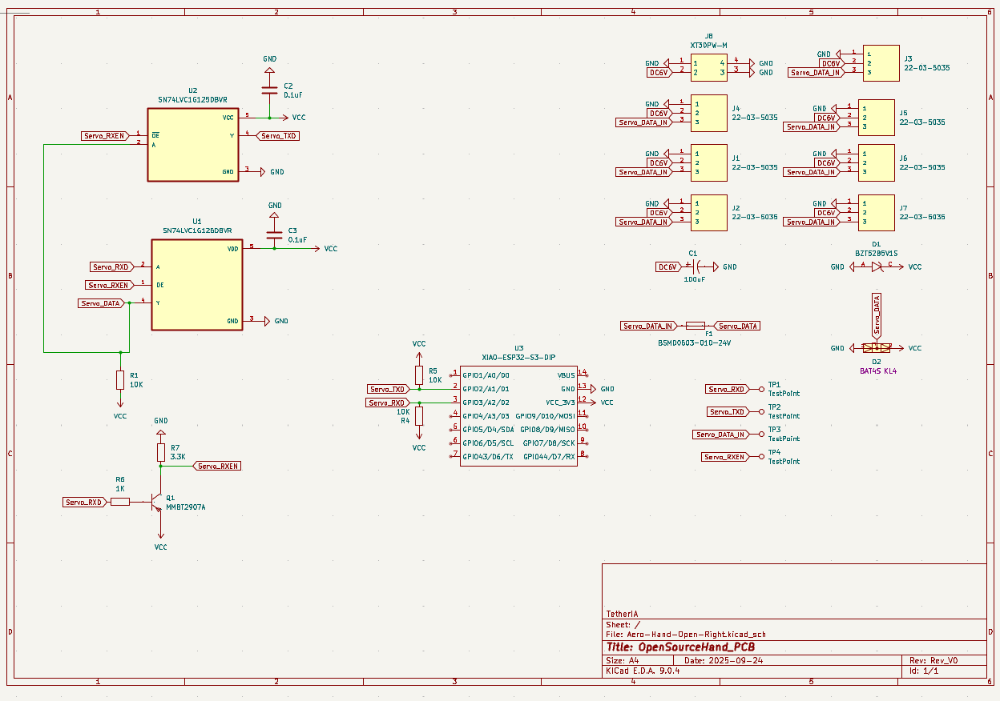
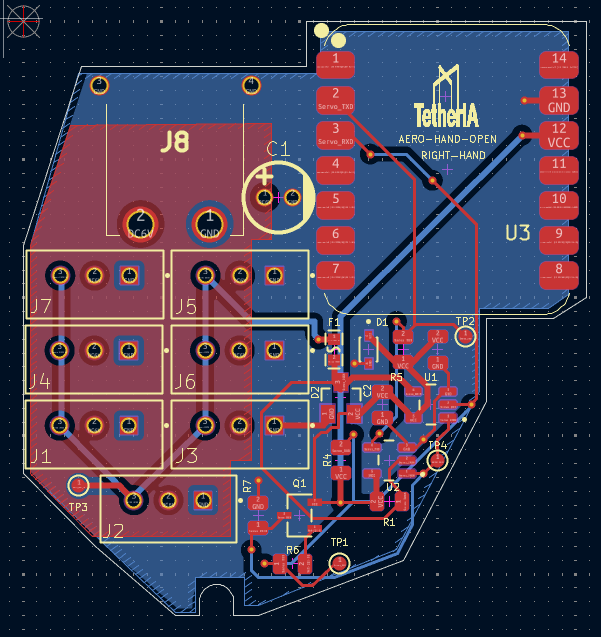
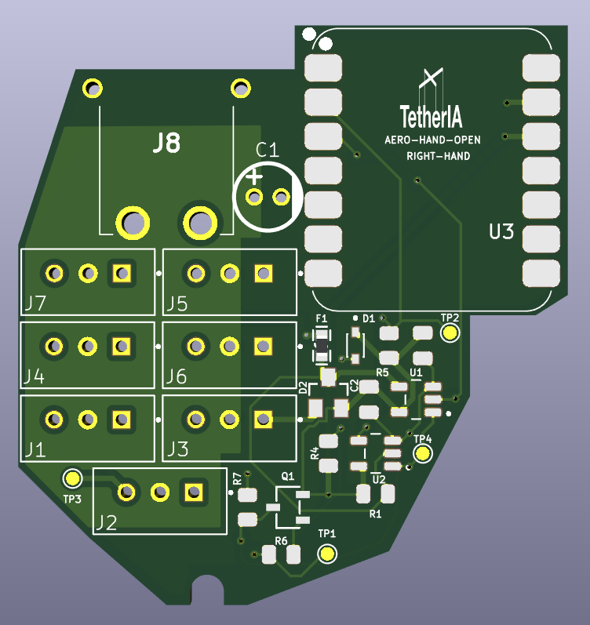

# PCB Overview

Our Aero Hand features a custom PCB design that fits seamlessly inside the hand enclosure, with dedicated layouts for both left and right hands. The design ensures reliable connectivity, compact integration, and ease of assembly for all actuators and electronics.

All design files—including Gerber files, KiCad project files, BOM, and CPL—are available in our [GitHub Repository](https://github.com/TetherIA/aero-hand-open/tree/main/hardware).

---

## Board A (Fits Inside Hand)
- 7 Molex connectors for connecting all servos.
- XT-30 Connector to power the hand.
- USB-C Connector to control the hand.
- Available in both left and right hand variants for optimal fit.

### Board Images

> **Note:** The above images are for the right hand. You can find the design files for the left hand in our [GitHub repository](https://github.com/TetherIA/aero-hand-open/tree/main/hardware).

---

For more details on communication and control, refer to our [SDK Documentation](https://github.com/TetherIA/aero-open-sdk).

Made with ❤️ by **TetherIA Robotics**

