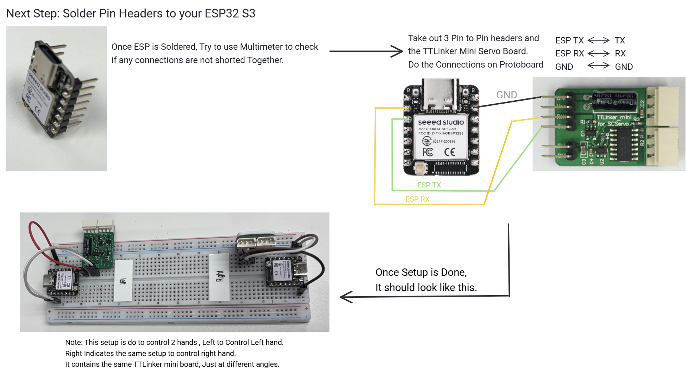
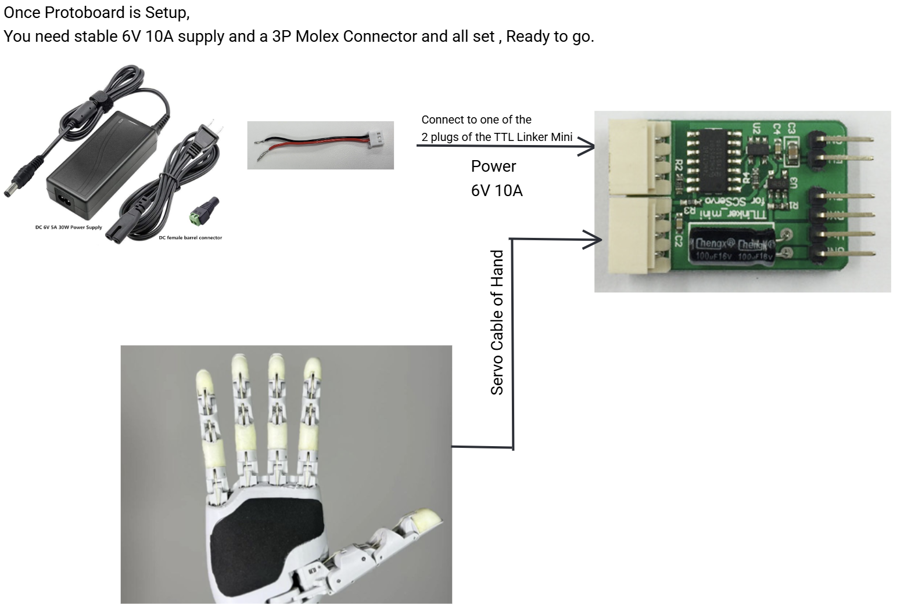
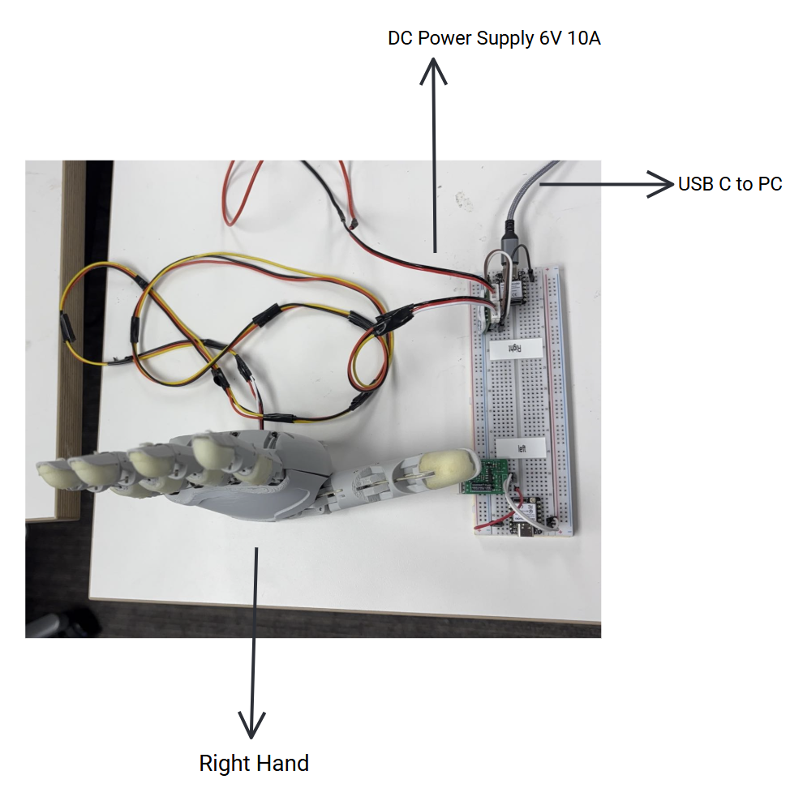
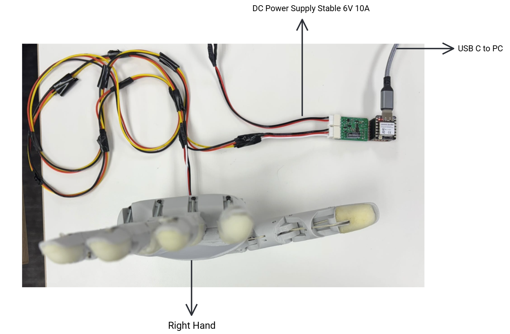

# Hardware Setup Guide

This page contains the complete hardware setup connections guide for the Aero Hand.

## View Instructions

You can view the setup guide PPTX below, or [Download it directly](./Hardware_Setup_Guide.pptx).

	<iframe
		src={require('./Hardware_Setup_Guide.pptx').default}
		style={{width: '100%', height: '100%', border: 'none'}}
		title="Hardware Setup Guide PPTX"
	/>

## Download

If the embedded viewer doesn't work in your browser, you can [download the PPTX file here](./Hardware_Setup_Guide.pptx).

## Manual Wiring Steps

You can use off-the-shelf protoboard and connectors (Molex 3-pin, JST) to manually wire and control the servos. This method requires careful soldering and wire management, and may not support maximum current for all motors. You will need:

- Protoboard
- Molex 3-pin connectors (for servos)
- JST connectors
- Servo cables
- Soldering tools

Once you have everything, refer to our guide under the Hardware Setup Guide folder, or follow the steps below:

### Step 1: Solder Pin Headers to ESP and connect to TTLinker Mini Board

### Step 2: Connect 6V 10A regulated power supply

### Step 3: Finished protoboard setup

---

Alternatively, if you want to do soldered connections directly on a board instead of using a protoboard, your connections will look like this:

### Finished direct soldering setup

:::tip
If you have any questions during setup, please reach out to our community on [Discord](https://discord.gg/CuREEmFz).
:::

Made with ❤️ by **TetherIA Robotics**

