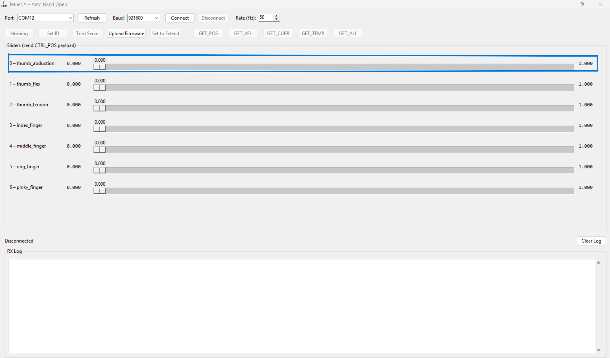
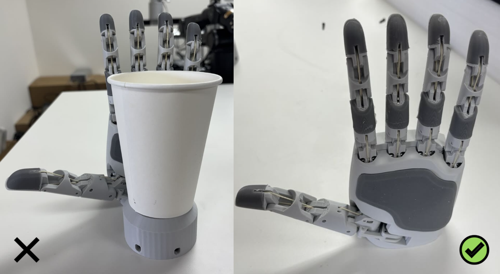

# Software Setup
## Step 1: Installation

The SDK is currently tested for Python 3.10 and above.

### Recommended: install via pip

**For Mac and Linux:**

```bash
pip install aero-open-sdk
```

**For Windows (using PowerShell):**

```powershell
python -m pip install --upgrade pip
python -m pip install aero-open-sdk
```

### Option 2: install from source (fetch latest updates)

1. Clone the repository to your local machine:
   ```bash
   git clone https://github.com/chestnut-robotics/aero-hand-open.git
   ```

2. Navigate to the SDK directory:
   ```bash
   cd aero-hand-open/sdk
   ```

3. Install the package in editable mode:
   ```bash
   pip install -e .
   ```

---

## Step 2: GUI — Aero Hand Open Control App

Launch the GUI from a terminal after installation:

**For Mac and Linux:**

```bash
aero-open-gui
```

**For Windows:**

```powershell
python -m aero_open_sdk
```

> **Note:** If your system can't find the command, ensure your Python environment's scripts directory is on PATH and that the package was installed into the active environment. For more troubleshooting Issues, refer at the end of the document under Troubleshooting section.


### Find port

Press the 'Refresh' button near the Port selection; a dropdown menu will appear. If you do not have multiple serial devices connected on a Windows machine, refreshing will automatically select the correct COM port. This is convenient when using only one hand. If you have multiple hands, unplug all devices and plug in one at a time to identify which COM port corresponds to each hand (right or left).

On Linux, after refreshing, you will find the device path such as `/dev/ttyACM0`, `/dev/ttyACM1`, or `/dev/ttyUSB*` and then connect the hand using the correct port.

### Homing

Once the hand is connected, you will see a Homing button in the GUI. Press this button to start homing. Make sure the hand is in a safe position with no obstacles in front of it. We recommend running homing if the motion is not as expected. During homing, the hand will not respond to other commands and will need some time to complete the process. When finished, you will receive an ACK in the GUI confirming homing is complete.

### Slide slider bar for position control

In the GUI, you can control the position of each finger or actuator using the slider bars. Each slider represents a channel (finger or thumb joint) and allows you to set its position from 0 (fully open/extended) to 1 (fully open/grasp). 



Simply click and drag the slider to your desired value, and the hand will move to that position in real time. This is useful for testing individual finger movements and for manually positioning the hand to some pose of your choice.

## Step 3: Python Control & Examples

Aero Hand connects to the host PC via a USB-C cable. In order to operate the SDK on Windows machine, you must need to specify the correct serial port for your device.

### Find port

#### Linux
You can initialize the hand directly if you are running and working only on one hand :
```python
from aero_open_sdk.aero_hand import AeroHand

aero_hand = AeroHand()
```
#### Windows

On Windows, the device connected to the USB port will appear as COM port like `COM12` or `COM3`. You can find the correct port by checking the Device Manager under "Ports (COM & LPT)". The device would be listed something like USB Serial Device (COM12).

You can then Initialize your hand with the detected COM port:
```python
from aero_open_sdk.aero_hand import AeroHand
aero_hand = AeroHand(port="COM3")
```

Once you know your device's port from the steps above, you can run any example file from the `sdk/examples` folder to test or control your Aero Hand Open.

### Run examples

#### [run_sequence](https://github.com/chestnut-robotics/aero-hand-open/blob/main/sdk/examples/run_sequence.py)

If homing is completed properly and the hand is in a safe position, running the [`run_sequence.py`](https://github.com/chestnut-robotics/aero-hand-open/blob/main/sdk/examples/run_sequence.py) example will move your hand through a series of poses: open palm, pinch each finger one by one, open palm, peace sign, open palm, rockstar sign, and back to open palm. 

You can also create any custom trajectory you want and use `hand.run_trajectory` to execute it.

#### [power_grasp](https://github.com/chestnut-robotics/aero-hand-open/blob/main/sdk/examples/power_grasp.py)

When you run the [`power_grasp.py`](https://github.com/chestnut-robotics/aero-hand-open/blob/main/sdk/examples/power_grasp.py) example, you can use the SPACEBAR on your keyboard to toggle the hand between open and closed grip poses. This allows you to quickly switch the hand's state for testing or demonstration purposes.

You can also change the open_pose and grip_pose to any pose that you want to go and then call the hand.set_joint_positions. Make sure to check the joint constants in the SDK, as your input values must be within the supported range for each joint else the inputs will be clipped to the upper and lower limit range.


#### Explore more examples
More examples are available at the [sdk folder](https://github.com/chestnut-robotics/aero-hand-open/tree/main/sdk/examples)


## Troubleshooting

### Installation Fails (`pip install` error)

If installation fails, try the following steps:

- Check your Python version:

    Make sure you have Python 3.10 or higher installed.

- 🔧 Upgrade pip to the latest version:

    Our package requires an up-to-date version of pip.

    You can upgrade pip with:
    ```bash
    pip install --upgrade pip
    ```

On Windows, if you see error like "pip is not recognized", use the `py` launcher command instead:

    ```bash
    py -m pip install --upgrade pip
    ```

### Path Mismatch on Windows

- You may not have the Python Scripts path added to your system PATH environment variable.

- To fix this, you can either:

  1. Add the Python Scripts directory (e.g., `C:\Users\<YourName>\AppData\Local\Programs\Python\Python310\Scripts`) to your system PATH.
  2. Or use the `py` launcher command to launch the GUI after installation:
      ```bash
      py -m aero_open_sdk
      ```
  3. Create a virtual environment and install the package there.
      ```bash
      python -m venv venv
      .\venv\Scripts\activate
      pip install aero-open-sdk
      aero-open-gui
      ```
### Troubleshooting Port Issues

#### Linux
On your Linux system , your Aero Hand open will show up as a device like `/dev/ttyACM0` or `/dev/ttyUSB0`. You can list down all the ports with :

```bash
ls /dev/ttyACM* /dev/ttyUSB*
```
**Note:** We recommend using a Persistent device path because the device names like `/dev/ttyACM0` can change each time you connect and can also be changed if you have multiple USB serial devices connected to your system. Also this will be helpful if you are working on more than 1 Hand.

To get a persistent name , use the by-id symlink instead:

```bash
ls -l /dev/serial/by-id/
```

This will show you a list of all the connected serial devices with more descriptive name. Look for the one that corresponds to your Aero Hand open. It will look something like:
```bash
usb-Espressif_USB_JTAG_serial_debug_unit_D8:3B:DA:45:C8:1C-if00
```

Then initialize your hand using that path while running the example code from SDK:
```python
from aero_open_sdk.aero_hand import AeroHand

aero_hand = AeroHand(
  port="/dev/serial/by-id/usb-Espressif_USB_JTAG_serial_debug_unit_D8:3B:DA:45:C8:1C-if00"
)
```
This ensures that connection always points to the correct device, even if you unplug and replug the same Aero Hand Open or change the USB port.

If you see a permission error when connecting to the serial port (e.g., `/dev/ttyACM0`), do the following:

1. Find your username:
   ```sh
   whoami
   ```
2. Add your user to the `dialout` group (replace `yourusername` with the output from `whoami`):
   ```sh
   sudo usermod -a -G dialout yourusername
   ```
3. **Restart your system** (or log out and log back in).
4. After restart, open a terminal and run:
   ```sh
   groups
   ```
   You should see your username and `dialout` listed.
5. Try connecting to the serial port again in the GUI.

If you still see permission errors, check device permissions with:
```sh
ls -l /dev/ttyACM0
```
You may need to temporarily set permissions:
```sh
sudo chmod 666 /dev/ttyACM0
```

#### Windows

Since windows does not have a /by-id/ system like Linux, so the COM Number can change if you plug the device in a different USB port but to make it permanent, you can assign a fixed COM Number by following the steps given below:
1. Unplug all the serial devices connected to USB port.
2. Plug in the Aero Hand and open Device Manager.
3. Find it under Ports (COM & LPT).
4. Right-click → Properties → Port Settings → Advanced.
5. In COM Port Number, select an unused port (e.g., COM5).
6. Click OK to save.

You can now always use this COM port when initializing the SDK.

### Common Cable Issues: Slack, Loose, or Derailed from Pulley


If the cable gets slack or loose during operation and you reconnect it, but the hand's motion is not correct, try performing the homing procedure again. Make sure to place the hand in a safe pose with no obstacles in front, as shown in the image below, before starting homing.




<div align="center">

Made with ❤️ by **Chestnut Robotics**

</div>


